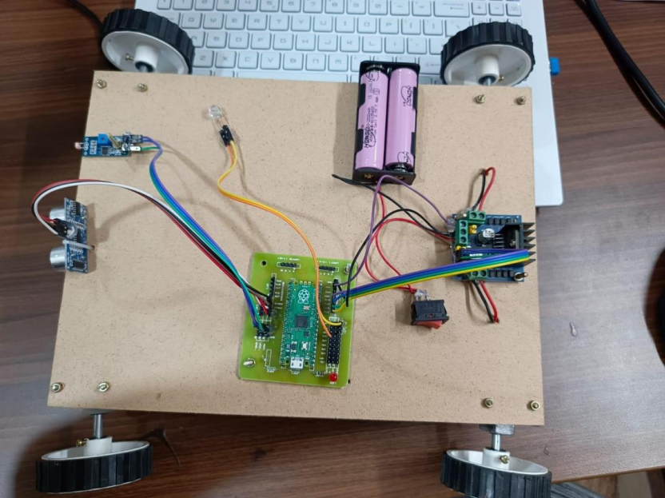

# Object Avoiding Car 🚗

A prototype autonomous electric vehicle that detects and avoids obstacles in real-time using an ultrasonic distance sensor and LDR light sensor, built with Raspberry Pi Pico and MicroPython.

## Overview

This smart car automatically stops and avoids any obstacle within **30cm** range, helping prevent accidents. It also uses an LDR sensor to detect light conditions and adjusts behavior accordingly.

## Demo

## Components Used

| Component | Purpose |
|-----------|---------|
| Raspberry Pi Pico | Main microcontroller |
| HC-SR04 Ultrasonic Sensor | Distance measurement |
| LDR Sensor Module | Light detection |
| L298N Motor Driver Module | Motor control |
| DC Motors (x4) | Wheel movement |
| Rechargeable Battery (18650) | Power supply |
| Raspberry Pi Pico HAT | GPIO expansion |
| Jumper Wires | Connections |
| Switch | Power on/off |

## How It Works

- The ultrasonic sensor continuously measures distance to obstacles
- If an obstacle is detected within **30cm**, the car stops all motors
- If path is clear and light conditions are normal, the car moves forward
- The LDR sensor monitors light levels to assist in decision making

## Tech Stack

- **Microcontroller:** Raspberry Pi Pico
- **Language:** MicroPython
- **Sensors:** HC-SR04 Ultrasonic, LDR Photosensitive
- **Motor Driver:** L298N

## Pin Configuration

| Pin | Component |
|-----|-----------|
| GP20 | Ultrasonic Trigger |
| GP21 | Ultrasonic Echo |
| GP27 | LDR Sensor |
| GP10-13 | Motor Control |
| GP6 | LED PWM |
| GP14 | Buzzer |

## How to Run

1. Clone this repository
2. Flash MicroPython firmware on your Raspberry Pi Pico
3. Copy `main.py` to the Pico using Thonny IDE
4. Connect components as per pin configuration in the code
5. Power on and the car starts automatically

## About

This project was built as part of my B.Tech CSE coursework at **VIT-AP University**, submitted to Dr. Chandan Kumar Pandey.

## Connect

- **LinkedIn:** [Divyanshu Raj](https://www.linkedin.com/in/divyanshu-raj-0a2498275)
- **GitHub:**